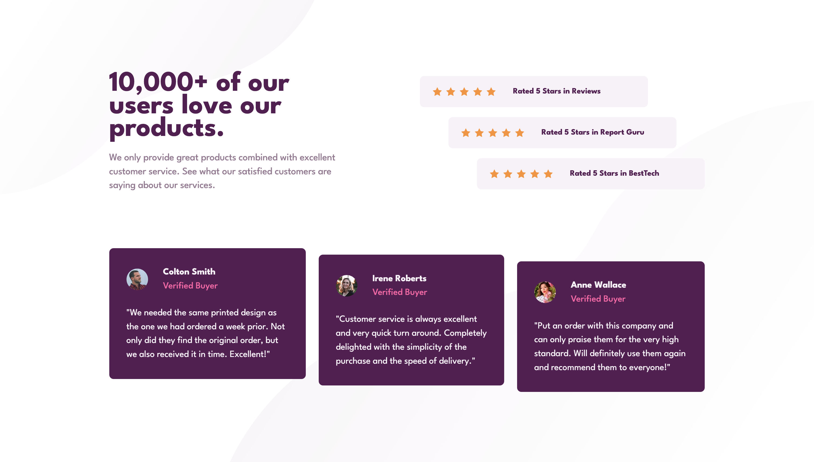

# Frontend Mentor - Social proof section solution

This is a solution to the [Social proof section challenge on Frontend Mentor](https://www.frontendmentor.io/challenges/social-proof-section-6e0qTv_bA). Frontend Mentor challenges help you improve your coding skills by building realistic projects. 

## Table of contents

- [Overview](#overview)
  - [The challenge](#the-challenge)
  - [Screenshot](#screenshot)
  - [Links](#links)
- [My process](#my-process)
  - [Built with](#built-with)
  - [Continued development](#continued-development)
- [Author](#author)

## Overview

### The challenge

Users should be able to:

- View the optimal layout for the section depending on their device's screen size

### Screenshot

### Links

- Solution URL: [Github repo here](https://github.com/nicholasboyce/social-proof-section)
- Live Site URL: [Github pages here](https://nicholasboyce.github.io/social-proof-section)

## My process

### Built with

- Semantic HTML5 markup
- CSS custom properties
- Flexbox
- CSS Grid
- Mobile-first workflow
- CSS named Grid lines
- CSS positioning

### Continued development

I really have to review how to properly size and deal with images and svgs in a responsive manner. I just copy and pasted the starts to have them as a set of five, but as the page shrinks, media queries are necessary in order to avoid seeing them become distorted. I also had to fix the size of the profile pictures using a grid, but I'm not quite sure this was the best solution. Any advice on how you solved this?

## Author

- Frontend Mentor - [@nicholasboyce](https://www.frontendmentor.io/profile/nicholasboyce)
